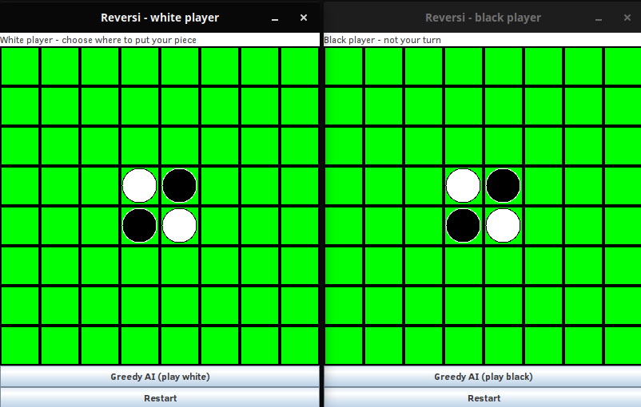
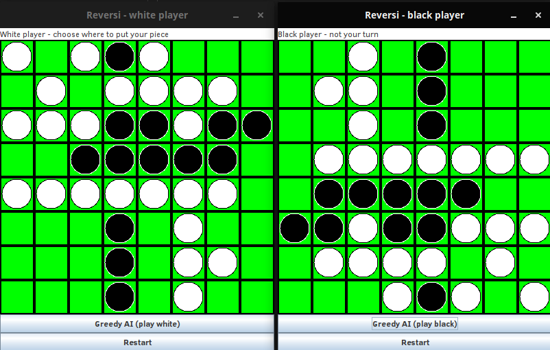

# READ ME

## Introduction

This is a simple project based on the board game Reversi, similar to Othello.
See this [Wikipedia page](https://en.wikipedia.org/wiki/Reversi#Rules) to learn the rules.

## Installation

Extract the downloaded directory. Use the Eclipse IDE to import these files and to compile to a `.jar` executable.